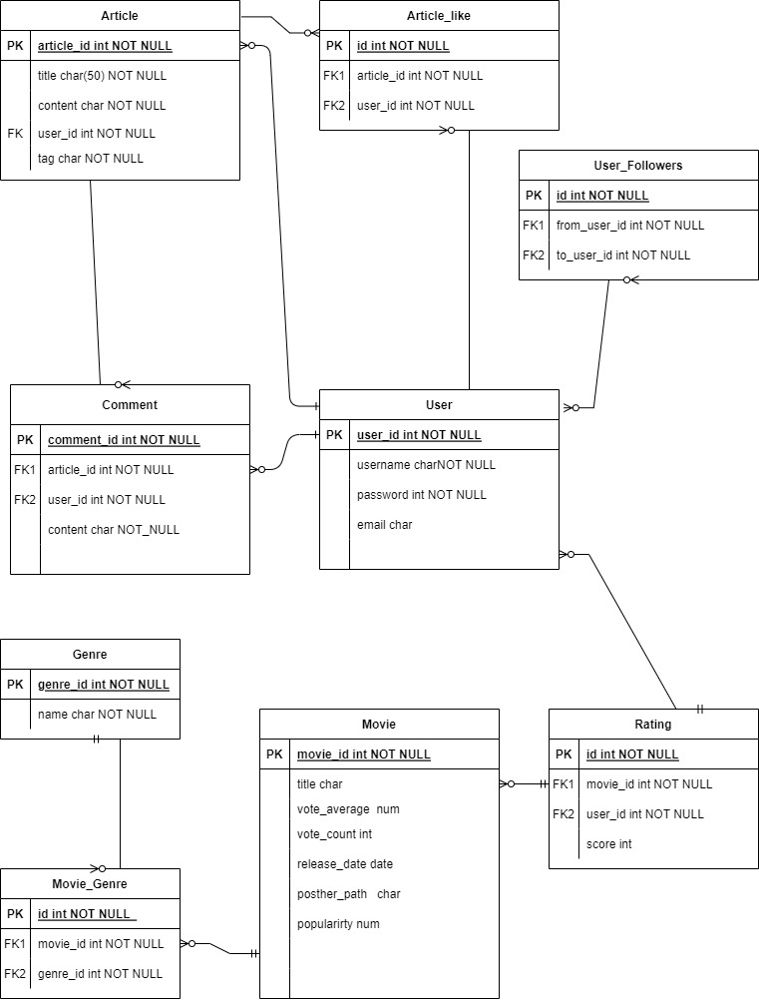
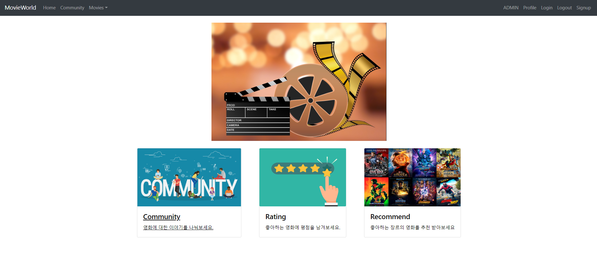
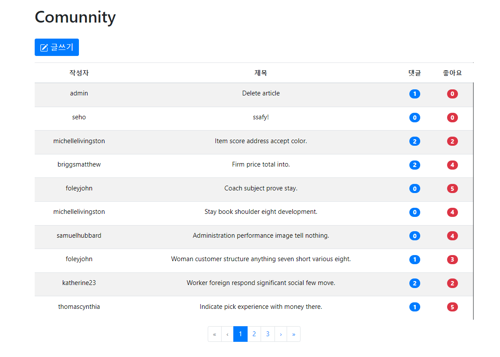
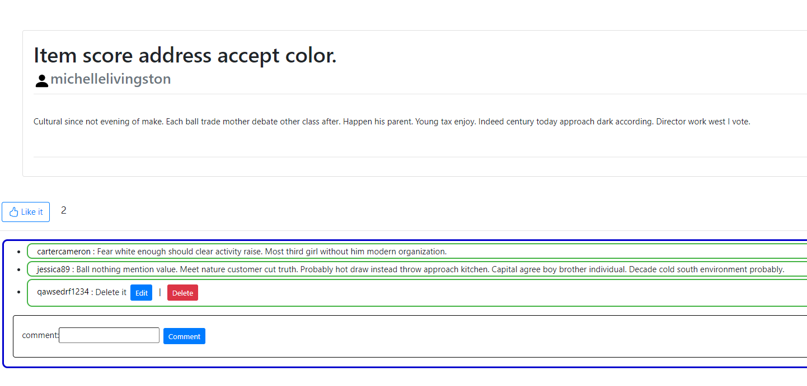
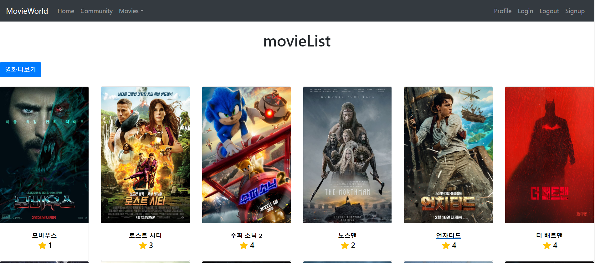
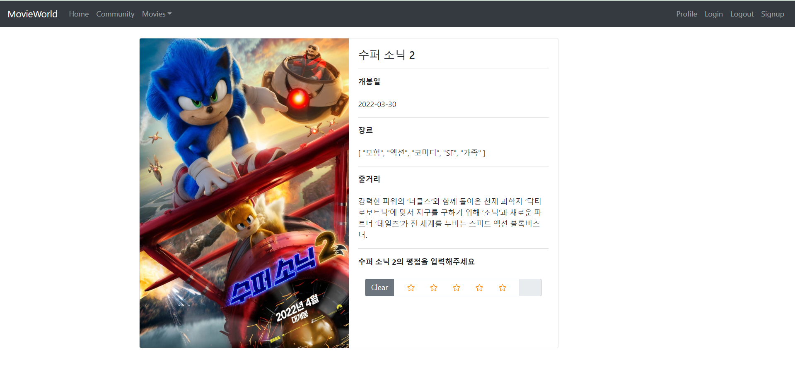
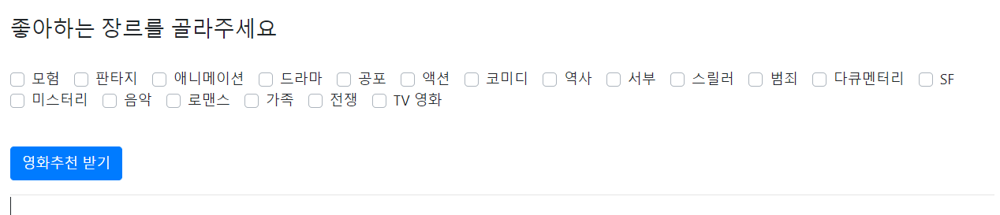
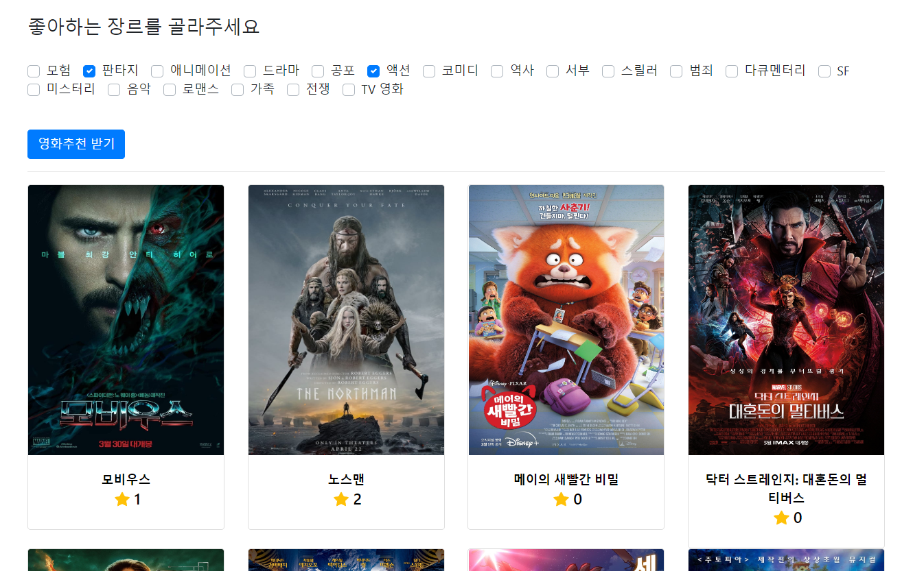
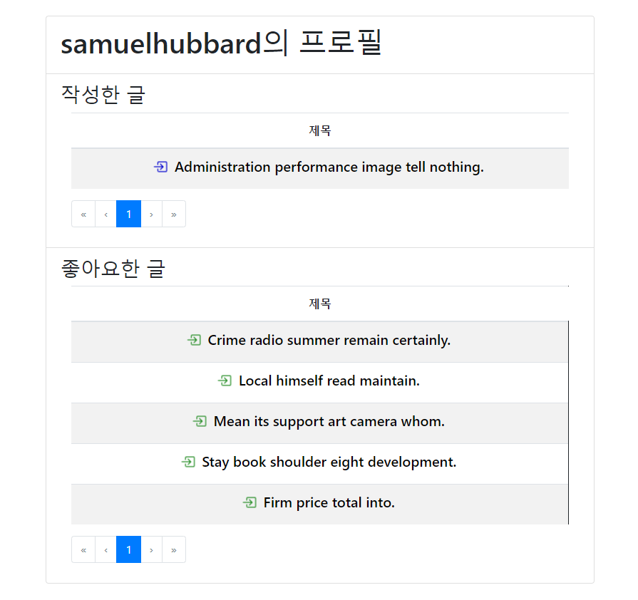

# Final PJT

[toc]

 

## 팀원
- 팀장 : 이동주
- 팀원 : 박세호

---

## 개요

### 설명
- TMDB 영화 데이터를 기반으로 영화 리뷰 사이트 구현

### 사용 Framework
- 백엔드 서버 Dango
	- axios 를 통한 API 데이터 요청
- 프론트 서버 Vue.js
	- Vuex를 통한 비동기적 구현이 중점.

---

## 일정 
| 요일 | 예정                                          |          |      |
| ---- | --------------------------------------------- | -------- | ---- |
| 월   | BE 구현                                       | 완료유무 | 비고 |
|      | 모델 Article, Comment, User, Movie            | O        |      |
|      | 각 모델, serializer 구현                      | O        |      |
|      | view, serializer, model, url                  | O        |      |
|      | admin 뷰 구현                                 | O        |      |
| 화   | FE 구현 (Home, Profile, Article, Comment)     | O        |      |
|      | router URl 설정                               | O        |      |
|      | API 호출 경로 설정                            | O        |      |
|      | Component, Views, Vuex 구현                   | O        |      |
|      | i) 게시판(Articles) CRUD 구현                 | O        |      |
|      | ii) 댓글 CRUD 구현                            | O        |      |
|      |                                               |          |      |
| 수   | FE 구현 ( Movie)                              | O        |      |
|      | Component, Views, Vuex 구현                   | O        |      |
|      | i) 좋아요(Movie-user), 팔로우(User-User) 구현 | △        |      |
|      | ii) 영화추천 알고리즘 구현(BE에 구현)         | O        |      |
| 목 : | CSS 마무리(Bootstrap)                         | O        |      |

---

## 데이터베이스 및 URL

### 데이터베이스

### API_URL(BackEnd, Django)

|         | URL패턴                        | 역할                     |
| ------- | ------------------------------ | ------------------------ |
| User    | /login/                        | -                        |
|         | /logout/                       | -                        |
|         | /signup/                       | -                        |
|         | /profile/\<username>/          | user 정보 조회           |
| Article | /                              | 전체 article 조회(Home)  |
|         | /articles/new/                 | airtlcie 생성            |
|         | /aritlces/<article_pk>/        | article detail           |
|         | /articles/<article_pk>/edit/   | aritcle 수정             |
| Movie   | /movies/                       | 전체 영화 조회           |
|         | /movies/\<movie_pk>/           | movie detail             |
|         | /movies/recommendations/       | 영화 추천                |
| Raiting | /<movie_pk>/rating/            | 해당 영화 평점 입력      |
|         | /<movie_pk>/rating/<rating_pk> | 해당 영화 평점 수정/삭제 |
| error   | /404/                          | error 페이지 통합        |

### router_URL(FrontEnd, Vue)

| 이름               | path                                  | component               |
| ------------------ | ------------------------------------- | ----------------------- |
| login              | /login                                | LoginView               |
| logout             | /logout                               | LogoutView              |
| signup             | /signup                               | SignupView              |
| profile            | /profile/:username                    | ProfileView             |
| home               | /                                     | HomeView                |
| articles           | /articles                             | ArticleListView         |
| articleNew         | /articles/new                         | ArticleNewView          |
| article            | /articles/:articlePk                  | ArticleDetailView       |
| articleEdit        | /articles/:articlePk/edit             | ArticleEditView         |
| movieList          | /movies                               | MovieListView           |
| movieDetail        | /movies/:moviePk                      | MovieDetailView         |
| movieRecommendList | /movies/recommendation                | MovieRecommendaListView |
| NotFound404        | /404 와 위의 path외 정의되지않는 path | NotFound404             |

---

## 구조 설계

###  App.vue
- header 에 navbar 로 각 router 생성(Home,  User, Login, Logout) 
- 로그인 상태에 따라 navbar 구성이 변경

### Home
**초기화면**

- 웹페이지 소개
- 하단 카드를 통해 router 이동
	- Movie 클릭시, 전체 영화 조회
	- MovieRecommend 클릭시, 추천 영화 조회
	- Article 클릭시, 게시글 조회

### Community 

#### Comunnity (url: "/articles")

- 게시글 작성 CRUD 
- 전체 Article 조회
	- Bootstrap vue 를 활용하여 List group으로 구성
	- Article의 작성자, 제목, 댓글 수, 좋아요 수 로 각 list item 구성
	- 제목 클릭시, 해당 Article 상세 페이지로 이동
		- Article title, content, Comment 로 구성
	- 작성자 클릭시, 해당 작성자의 User Profile 페이지로 이동
- 글쓰기 버튼
	- 클릭시 Article 작성 페이지(/articles/new/ )로 이동
#### Article(url: "/article/{articlePk}")

- 해당 Article의 제목, 작성자, content 출력
- 좋아요 버튼, 좋아요 수 출력
  - 좋아요 클릭시 좋아요 수 변경, 비동기적 작동
- 댓글 Group List 로 출력
  - 작성자, 댓글 내용, (해당 댓글의 작성자의 경우 edit, delete 추가 출력)
  - 비동기적 작동.

### Rating

#### Movie (url: "/movies")

- TMDB API통해 요청한 데이터를 fixture로 형성

- 순위에 따른 출력

- 영화 포스터, 제목, 평점 을 카드로 출력.

- card component 로 나열(2\*6)
	- 영화 card 선택시, 해당 영화의 상세 정보 조회
	- 상세 정보 조회시, user 가 login 시에 해당 영화의 평점 기입 가능.
	
	
#### MovieDetail (url: "/movies/moviePk")

- 해당 영화의 상세 페이지
- 포스터 이미지, 제목, 개봉일, 장르, 줄거리, 평점 입력 form 출력

#### MovieRecommend(url: "/recommendation")

- 초기화면

****

- 장르 선택시, 해당 장르를 포함하는 영화 리스트 출력

### Profile(url: "/profile/username")

- 해당 유저의 작성한 글, 좋아요한 글 출력.
- 글 제목 클릭시 해당 Article 로 이동

---

**작업기록**

- 2022.05.20
	
	- 작업시작.
	1. README(작업 일정, DB설계, API_URL 설계, 구조 설계) 초안 작성
	1. BE에 필요한 Fixtures 생성(movies, genres)
	1. BE의 Movie, Raiting, Genre 등의 model 및 serializer 추가
	
	- 위 관련 views 작업 예정

- 2022.05.23
	
	- BE 작업 마무리
	1. Movie, Rating 관련 view, serializer 완료
	1. FE의 Home, movie, article 등 기본적인 배치 완료
	
- 2022.05.24

  - FE 구현, 그에 따른 BE 수정

  1. Movie 전체조회, 상세조회 페이지 완료
     - router, drf 설정
     - store-module의 index 구현
  2. Rating Form 형성(bootstrapVue의 b-form-rating)
     - Rating의 input에 조건 제한 형성(0~5사이의 정수, 입력완료/입력생성 구분)
  3. NavBar의 home, movie 메뉴를 home에 위치하도록 구상.
  
  - Rating Form 마무리, 추천 알고리즘 구상 및 적용, 좋아요/팔로우 기능 구현 예정
  
- 2022.05.24
	- Rating Form 마무리, 추천 알고리즘 구상 및 적용, 완료
	- HTML/CSS 적용
		1. home
		2. article
		3. movies
			- movie list
			- movie recommend
		4. profile
	
- 2022.05.25

  - Movie, Community(Article), Rating HTML/CSS 적용
    - bootstrap-vue 사용
  - Profile, login, logout HTML/CSS 적용
    - bootstrap-vue 사용
  - 동기적 접근하는 부분 최대한 비동기적으로 변환
  - Movies fixture data 기존 50개에서 200개로 증식
  - 시연을 위한 Article, Comment, Likes_articles, User 등의 모델에 더미데이터 생성
  - 기능 구현에 대한 디버깅 진행
  - 기존에 계획한 기능 구현의 80% 완료
    -  유저간 팔로잉, Rating 및 Articles 기반 추천 알고리즘 등의 기능 미구현.