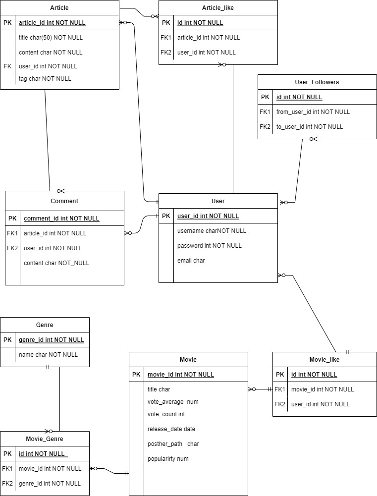

# Final PJT
### 팀원
- 팀장 : 이동주
- 팀원 : 박세호

## 일정 
- 월 : BE  구현
	- 모델  Article, Comment, User, Movie
	- 각 모델, serializer 구현
	- view, serializer, model, url 
	- admin 뷰 구현
	
- 화, 수 : FE 구현 (Home, Profile, Article, Comment)

  - router URl  설정

  - API 호출 경로 설정

  - Component, Views, Vuex 구현

    - 게시판(Articles) CRUD 구현

    - 댓글 CRUD 구현

- 수 : FE 구현 ( Movie)

  - Component, Views, Vuex 구현

    - 좋아요(Movie-user), 팔로우(User-User) 구현
    - 영화추천 알고리즘 구현(BE에 구현)

- 목 : CSS 마무리(Bootstrap)

  


- Vue, DRF 구현하기
- 서버 2개 돌리는걸로 시작하기.

1. 게시판

   1. 게시판 CRUD
      1. 기존 테이블에 게시판  내용종류(말머리) 추가(Article)
   2. 댓글 구현(대댓글)

2. 유저

   1. 팔로우, 팔로워

   2. 게시글 좋아요

   3. 프로필
      1. 해당 유저 정보(팔로우/ 팔로워)
      2. 해당 유저 좋아요한 게시글
      3. 해당 유저가 좋아요한 영화
      4. 해당 유저의 자기소개글

3. 영화추천 알고리즘
   1. 좋아요한 영화와 선호하는 장르를 토대로 API 요청을 하여 데이터 가져오기
      - 중복 데이터에 대해 가중치 주어 상위에 노출
   2. Article 연동으로 영화에 대한 선호도 기반으로 추천 알고리즘
      - 게시글중에 타이틀, 컨텐트에 ORM을 통해 영화 관련 키워드를 추출하여 전체 게시글 대비 얼마나 많은 특정 영화 관련 게시글이 있는지 추출
      - 그에 따라 상위 영화에 대한 추천

4. 영화 페이지
   1. 평점기준/ 관객수기준/ 등의 기준으로 5개 씩 해서 3줄로 출력
   2. (추가 기능) 랜덤으로 10개 영화나오고 좋아요 누르기.
   3. 페이지네이션?




#### 요청 URL

1. Article
   - URL : backend/articles/

```json
articles = {
    title = "char",
    content = "char",
    user_id = int,
    tag = "char",
    
    comments = [
    	...
    ],
	article_likes = [
        ...
    ],     
}
        
comments = {
    article_id = int
    user_id = int
    content = "char"
}
```


2. User
   - URL : backend/accounts/<username>

```json
user = {
    username = <username>,
    
    articles = [
    	...
    ],
	comments = [
        ...
    ],
    followers = [
        ...
    ],
    followings = [
        ...
    ],
    like_movies = [
        ...
    ],
}
```

3. Movies
   - URL : backend/Movies

```jso
movies = [
	...movies basic attributes,
	movie_like_user =[
        ...
    ],
    genre = [
    	...
    ],
]
```


